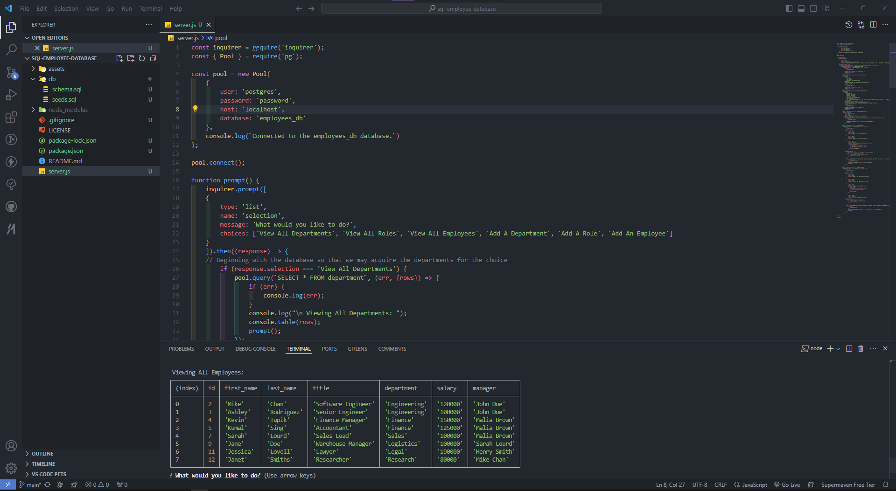

# sql-employee-database

12-SQL/02-Challenge - Employee Database using SQL and Inquirer

## Description

Module 12 - SQL: Employee Database using SQL and Inquirer

Development of a database using SQL and Inquirer to create a database with departments, roles, and employees, through the execution of the following:

- user input prompts for viewing all departments, roles, and employees
- user input prompts for adding a department, role, and employee

Project executed in accordance with the following challenge requirements:

### User Story

```md
AS A business owner
I WANT to be able to view and manage the departments, roles, and employees in my company
SO THAT I can organize and plan my business
```

### Acceptance Criteria

```md
GIVEN a command-line application that accepts user input
WHEN I start the application
THEN I am presented with the following options: view all departments, view all roles, view all employees, add a department, add a role, add an employee, and update an employee role
WHEN I choose to view all departments
THEN I am presented with a formatted table showing department names and department ids
WHEN I choose to view all roles
THEN I am presented with the job title, role id, the department that role belongs to, and the salary for that role
WHEN I choose to view all employees
THEN I am presented with a formatted table showing employee data, including employee ids, first names, last names, job titles, departments, salaries, and managers that the employees report to
WHEN I choose to add a department
THEN I am prompted to enter the name of the department and that department is added to the database
WHEN I choose to add a role
THEN I am prompted to enter the name, salary, and department for the role and that role is added to the database
WHEN I choose to add an employee
THEN I am prompted to enter the employee’s first name, last name, role, and manager, and that employee is added to the database
WHEN I choose to update an employee role
THEN I am prompted to select an employee to update and their new role and this information is updated in the database
```

## Table of Contents

- [Installation](#installation)
- [Usage](#usage)
- [Credits](#credits)
- [License](#license)

## Installation

Install [NodeJS](https://nodejs.org/en) and NPM on your computer to install the required dependencies for this NodeJS application.

Git and an IDE (VSCode recommended) are required to be installed on your computer to clone and view the code for this web application.

From your command line:

```md
### Clone this repository
$ git clone git@github.com:ajhearne-mZAOSW/sql-employee-database.git

### Navigate into the repository
$ cd sql-employee-database

### Open in IDE
$ code .
```

In the integrated terminal, run the following commands:

```md
### Install dependencies
npm install

### Run the application
npm start
```

The application will then prompt you for user inputs to navigate through the database.

## Usage

The following image shows the application's appearance and functionality:



A video showing process for using the application can be found [here.](./assets/HearneAlana_SQLEmployeeTracker.webm)

## Credits

- Learning foudation provided by University of Sydney, USYD-VIRT-FSF-PT-05-2024-U-LOLC/12-SQL/01-Activities

## License

MIT
